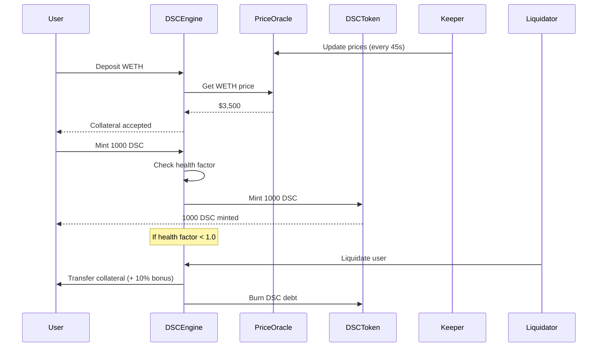

# 🪙 Decentralized Stable Coin (DSC)

> An algorithmic, over-collateralized stablecoin pegged to USD, backed by WETH and WBTC

[](https://opensource.org/licenses/MIT)
[](https://soliditylang.org/)
[](https://book.getfoundry.sh/)
[](https://github.com/foundry-rs/foundry)

## 📋 Table of Contents

- [Overview](#-overview)
- [Features](#-features)
- [Architecture](#-architecture)
- [Smart Contracts](#-smart-contracts)
- [Getting Started](#-getting-started)
- [Usage](#-usage)
- [Testing](#-testing)
- [Deployment](#-deployment)
- [Security](#-security)
- [License](#-license)

---

## 🎯 Overview

DSC (Decentralized Stable Coin) is a decentralized stablecoin protocol that maintains a 1:1 peg with USD through over-collateralization. Similar to DAI, but with key differences:

- ❌ **No Governance** - Fully algorithmic and trustless
- ❌ **No Fees** - Zero protocol fees for users
- ✅ **200% Over-collateralized** - Backed by WETH and WBTC
- ✅ **Pyth Oracle** - Real-time price feeds with sub-second latency
- ✅ **Liquidation Mechanism** - 10% bonus for liquidators

### Key Properties

| Property              | Description               |
| --------------------- | ------------------------- |
| **Collateral Type**   | Exogenous (WETH & WBTC)   |
| **Minting Mechanism** | Algorithmic               |
| **Stability**         | Pegged to USD             |
| **Collateralization** | 200% minimum              |
| **Oracle**            | Pyth Network (Push model) |

---

## ✨ Features

### Core Functionality

- **🏦 Deposit & Withdraw Collateral**

  - Support for WETH and WBTC
  - Permissionless deposits
  - Health factor-protected withdrawals

- **💵 Mint & Burn DSC**

  - Algorithmic minting based on collateral value
  - Maintains 200% collateralization ratio
  - Instant burning mechanism

- **⚡ Liquidation System**

  - Automated liquidation of undercollateralized positions
  - 10% liquidation bonus incentive
  - Partial liquidations supported

- **📊 Real-time Price Feeds**
  - Pyth Network integration
  - Sub-second price updates
  - Keeper-based push model

### Advanced Features

- **🔒 ReentrancyGuard** - Protection against reentrancy attacks
- **💊 Health Factor Monitoring** - Real-time solvency checks
- **🎯 Gas Optimized** - Efficient storage patterns
- **📈 View Functions** - Comprehensive state queries

---

## 🏗️ Architecture

### System Components

```
┌─────────────────────────────────────────────────────────────┐
│                         DSC Protocol                        │
├─────────────────────────────────────────────────────────────┤
│                                                             │
│  ┌──────────────┐      ┌──────────────┐      ┌───────────┐  │
│  │  DSCEngine   │◄────►│     DSC      │      │   Pyth    │  │
│  │   (Core)     │      │   (Token)    │      │  Oracle   │  │
│  └──────┬───────┘      └──────────────┘      └─────▲─────┘  │
│         │                                          │        │
│         │                                          │        │
│  ┌──────▼──────────────────────────────────────────┴──────┐ │
│  │            PriceConsumer Library                       │ │
│  │  • getPricePush() - Keeper-updated prices              │ │
│  │  • Price validation & conversion                       │ │
│  └────────────────────────────────────────────────────────┘ │
│                                                             │
│  ┌────────────────────────────────────────────────────────┐ │
│  │              Collateral Tokens                         │ │
│  │  • WETH (Wrapped Ether)                                │ │
│  │  • WBTC (Wrapped Bitcoin)                              │ │
│  └────────────────────────────────────────────────────────┘ │
│                                                             │
└─────────────────────────────────────────────────────────────┘
```

### Protocol Flow



---

## 📦 Smart Contracts

### Core Contracts

#### DSCEngine.sol

The main protocol logic contract.

**Key Functions:**

```solidity
// Deposit & Mint
function depositCollateralAndMintDsc(address token, uint256 collateral, uint256 dsc) external
function depositCollateral(address token, uint256 amount) public
function mintDsc(uint256 amount) public

// Withdraw & Burn
function burnDscAndWithdrawCollateral(address token, uint256 collateral, uint256 dsc) external
function withdrawCollateral(address token, uint256 amount) public
function burnDsc(uint256 amount) public

// Liquidation
function liquidate(address collateral, address user, uint256 debtToCover) external

// View Functions
function getHealthFactor(address user) public view returns (uint256)
function getCollateralValue(address user) public view returns (uint256)
function getAccountInformation(address user) public view returns (uint256, uint256)
```

#### DecentralizedStableCoin.sol

ERC20 stablecoin token with burn capability.

```solidity
function mint(address to, uint256 amount) external onlyOwner returns (bool)
function burn(uint256 amount) public override onlyOwner
```

#### PriceConsumer.sol

Library for Pyth Oracle integration.

```solidity
function oracle_getPricePush(
    IPyth pythContract,
    bytes32 priceFeedId,
    uint256 maxAge
) internal view returns (uint256)
```

### Contract Addresses

| Network | Contract    | Address                                      |
| ------- | ----------- | -------------------------------------------- |
| Sepolia | Pyth Oracle | `0x2880aB155794e7179c9eE2e38200202908C17B43` |
| Sepolia | DSCEngine   | TBD                                          |
| Sepolia | DSC Token   | TBD                                          |

---

## 🚀 Getting Started

### Prerequisites

```bash
# Install Foundry
curl -L https://foundry.paradigm.xyz | bash
foundryup

# Verify installation
forge --version
cast --version
anvil --version
```

### Installation

```bash
# Clone repository
git clone https://github.com/raihanmd/dai-like-stablecoin
cd dai-like-stablecoin

# Install dependencies
forge install

# Build contracts
forge build
```

### Environment Setup

Create a `.env` file:

```bash
# MAINNET RPC URLS
BASE_RPC_URL=https://mainnet.base.org

# TESTNET RPC URLS
ETH_SEPOLIA_RPC_URL=https://eth-sepolia.g.alchemy.com/v2/API_KEY
LISK_SEPOLIA_RPC_URL=https://rpc.sepolia-api.lisk.com
BASE_SEPOLIA_RPC_URL=https://sepolia.base.org

ETHERSCAN_API_KEY=API_KEY
```

---

## 💡 Usage

### For Users

#### 1. Deposit Collateral and Mint DSC

```solidity
// Approve WETH
IERC20(weth).approve(dscEngine, 10 ether);

// Deposit 10 WETH and mint 7000 DSC (50% LTV)
dscEngine.depositCollateralAndMintDsc(
    weth,           // collateral token
    10 ether,       // collateral amount
    7000 ether      // DSC to mint
);
```

#### 2. Check Health Factor

```solidity
uint256 healthFactor = dscEngine.getHealthFactor(userAddress);
// healthFactor >= 1e18 = healthy
// healthFactor < 1e18 = can be liquidated
```

#### 3. Burn DSC and Withdraw

```solidity
// Burn DSC and withdraw collateral
dscEngine.burnDscAndWithdrawCollateral(
    weth,
    5 ether,        // withdraw amount
    3500 ether      // DSC to burn
);
```

### For Liquidators

```solidity
// Liquidate undercollateralized position
dscEngine.liquidate(
    weth,              // collateral to seize
    badUserAddress,    // user to liquidate
    5000 ether         // DSC debt to cover
);
// Receives collateral + 10% bonus!
```

### For Developers

#### Running Tests

```bash
# Run all tests
forge test

# Run with verbosity
forge test -vvv

# Run specific test
forge test --match-test test__success_userShouldCanDepositAndTriggerEvent

# Run with gas report
forge test --gas-report

# Run coverage
forge coverage
```

#### Invariant Testing

```bash
# Run invariant tests
forge test --match-contract InvariantTest

# With detailed output
forge test --match-contract InvariantTest -vvv
```

---

## 🧪 Testing

### Test Coverage

Current coverage: **88.05%**

```
╭────────────────────────────+──────────+──────────────+────────────+──────────╮
| File                       | % Lines  | % Statements | % Branches | % Funcs  |
+==============================================================================+
| DSCEngine.sol              | 90.60%   | 89.92%       | 46.15%     | 86.21%   |
| DecentralizedStableCoin.sol| 69.23%   | 66.67%       | 0.00%      | 100.00%  |
| PriceConsumer.sol          | 100.00%  | 100.00%      | 100.00%    | 100.00%  |
╰────────────────────────────+──────────+──────────────+────────────+──────────╯
```

### Test Structure

```
test/
├── unit/
│   ├── DSCEngine.t.sol           # Core logic tests
│   ├── DecentralizedStableCoin.t.sol
│   └── PriceConsumer.t.sol
├── invariant/
│   ├── InvariantTest.t.sol       # Stateful fuzzing
│   └── Handler.t.sol
└── BaseTest.t.sol                # Test utilities
```

### Key Test Scenarios

✅ Deposit collateral successfully  
✅ Mint DSC with valid collateral  
✅ Health factor calculations  
✅ Liquidation mechanism  
✅ Price oracle integration  
✅ Reentrancy protection

---

## 📤 Deployment

### Local Deployment (Anvil)

```bash
# Terminal 1: Start Anvil
anvil

# Terminal 2: Deploy
forge script script/DSCEngineDeploy.s.sol:DSCEngineDeploy \
    --rpc-url http://localhost:8545 \
    --broadcast
```

### Testnet Deployment (Sepolia)

```bash
# Deploy to Sepolia
forge script script/DSCEngineDeploy.s.sol:DSCEngineDeploy \
    --rpc-url $SEPOLIA_RPC_URL \
    --broadcast \
    --verify \
    --etherscan-api-key $ETHERSCAN_API_KEY
```

### Mainnet Deployment

```bash
# ⚠️ CAUTION: Mainnet deployment
forge script script/DSCEngineDeploy.s.sol:DSCEngineDeploy \
    --rpc-url $MAINNET_RPC_URL \
    --broadcast \
    --verify \
    --etherscan-api-key $ETHERSCAN_API_KEY \
    --slow
```

<!-- ### Post-Deployment Setup

```bash
# Setup keeper bot
cd keeper-bot
npm install

# Configure .env
cp .env.example .env
# Edit .env with deployed addresses

# Start keeper
npm start
``` -->

---

## 🔐 Security

### Audits

- ⏳ **Pending**: Professional audit scheduled
- ✅ **Internal Review**: Completed
- ✅ **Test Coverage**: 88.05%

### Known Issues ⚠️

1. **Oracle Dependency**: Protocol relies on Pyth keeper for price updates
2. **Liquidation Risk**: If protocol becomes <100% collateralized, liquidation incentives break
3. **Price Manipulation**: Vulnerable to flash loan attacks on thin liquidity

### Security Best Practices

✅ ReentrancyGuard on all state-changing functions  
✅ Checks-Effects-Interactions pattern  
✅ Comprehensive input validation  
✅ Health factor checks before operations  
✅ Emergency pause mechanism (manual)

### Bug Bounty

This is just a side project, so there is no bug bounty program. If you find a vulnerability, please report it to the maintainers.

---

## 🛠️ Development

### Project Structure

```
.
├── src/
│   ├── DSCEngine.sol                 # Core protocol logic
│   ├── DecentralizedStableCoin.sol   # ERC20 stablecoin
│   └── lib/
│       └── PriceConsumer.sol         # Oracle integration
├── script/
│   ├── DSCEngineDeploy.s.sol
│   ├── DecentralizedStableCoinDeploy.s.sol
│   └── interactions/
│       └── PythInteractions.s.sol
├── test/
│   ├── unit/
│   ├── invariant/
│   └── BaseTest.t.sol
└── foundry.toml
```

### Key Scripts

```bash
# Format code
forge fmt

# Lint
forge fmt --check

# Gas optimization report
forge test --gas-report

# Deploy script simulation
forge script script/DSCEngineDeploy.s.sol
```

---

## 📊 Economics

### Collateralization Ratios

| Action      | Min. Health Factor | Collateral Ratio |
| ----------- | ------------------ | ---------------- |
| Mint DSC    | ≥ 1.0              | 200%             |
| Safe Zone   | > 1.5              | 300%+            |
| Liquidation | < 1.0              | <200%            |

### Liquidation Example

```
User Position:
- Collateral: 1 ETH @ $4,000 = $4,000
- Minted DSC: 2,500 DSC
- Health Factor: (4000 * 0.5) / 2500 = 0.8 ❌

Price drops to $3,000:
- Collateral: 1 ETH @ $3,000 = $3,000
- Health Factor: (3000 * 0.5) / 2500 = 0.6 ❌

Liquidator pays: 2,500 DSC
Liquidator receives: 2,500 / 3,000 = 0.833 ETH + 10% = 0.916 ETH
Value: $2,750 (profit: $250)
```

---

## 🤝 Contributing

We welcome contributions! Please follow these guidelines:

1. Fork the repository
2. Create a feature branch (`git checkout -b feature/AmazingFeature`)
3. Write tests for your changes
4. Ensure all tests pass (`forge test`)
5. Format code (`forge fmt`)
6. Commit your changes (`git commit -m 'Add some AmazingFeature'`)
7. Push to the branch (`git push origin feature/AmazingFeature`)
8. Open a Pull Request

### Development Guidelines

- Follow Solidity style guide
- Maintain test coverage above 85%
- Add NatSpec documentation
- Update README for new features

---

## 📚 Resources

### Documentation

- [Foundry Book](https://book.getfoundry.sh/)
- [Pyth Network Docs](https://docs.pyth.network/)
- [OpenZeppelin Contracts](https://docs.openzeppelin.com/contracts/)

### Related Projects

- [MakerDAO DAI](https://makerdao.com/)
- [Liquity LUSD](https://www.liquity.org/)
- [Synthetix](https://synthetix.io/)

---

## 📝 License

This project is licensed under the MIT License - see the [LICENSE](LICENSE) file for details.

---

## 👤 Author

**Raihan MD**  
[@raihanmd](https://github.com/raihanmd)

---

## 🙏 Acknowledgments

- Patrick Collins for DeFi education
- Foundry team for excellent tooling
- Pyth Network for oracle infrastructure
- OpenZeppelin for secure contract libraries
- The Ethereum community

---

## ⚠️ Disclaimer

This project is for educational purposes. Use at your own risk. The code has not been audited and should not be used in production without proper security review.

---

<div align="center">

### 🌟 Star us on GitHub!

Made with ❤️ by [raihanmd](https://github.com/raihanmd)

</div>
